```mermaid
flowchart LR
    subgraph Client[관리자 클라이언트]
        UI["브라우저 UI (Thymeleaf + JS)"]
    end

    subgraph Backend[Camping Admin Service]
        direction TB
        AuthLayer["Security Layer\n(JWT Auth Filter, JwtService)"]

        subgraph Presentation[Presentation Layer]
            ConsoleControllers["Console Controllers\n(dashboard, reservations, campsites, products, revenue)"]
            AdminApiControllers["Admin REST Controllers\n(reservations, campsites, products, rentals, revenue)"]
            SalesController["Sales API Controller"]
        end

        subgraph Business[Business Services]
            ReservationWorkflow["Reservation Workflow\n(status handling, DTO mapping)"]
            ProductService["ProductService"]
            RentalService["RentalService"]
            SalesService["SalesService"]
        end

        subgraph Persistence[Persistence Layer]
            ReservationRepo["ReservationRepository"]
            CampsiteRepo["CampsiteRepository"]
            ProductRepo["ProductRepository"]
            RentalRepo["RentalRecordRepository"]
            SalesRepo["SalesRecordRepository"]
            CustomerRepo["CustomerRepository"]
        end

        subgraph Domain[Domain Entities]
            ReservationEntity["Reservation"]
            CampsiteEntity["Campsite"]
            ProductEntity["Product"]
            RentalEntity["RentalRecord"]
            SalesEntity["SalesRecord"]
            CustomerEntity["Customer"]
        end
    end

    subgraph Infra[Infrastructure]
        H2["H2 In-Memory DB"]
        DataSQL["data.sql Seed"]
        SpringConfig["Spring Boot Config\n(application.yml, WebConfig)"]
    end

    UI -->|요청| AuthLayer
    AuthLayer --> Presentation
    Presentation --> Business
    Business --> Persistence
    Persistence --> Domain
    Persistence -->|JPA| H2

    DataSQL --> H2
    SpringConfig --> AuthLayer
    SpringConfig --> Presentation
    SpringConfig --> Business

    SalesController --> Business
    ConsoleControllers --> Business
    AdminApiControllers --> Business

    Business -.domain 객체 사용.-> Domain
```

# 아키텍처

# 아키텍처

## 개요
- Spring Boot 3.2 기반 모놀리식 애플리케이션으로 src/main/java/com/camping/admin/CampingAdminServiceApplication.java에서 기동합니다.
- 도메인·리포지토리·서비스·웹(Thymeleaf)·REST 컨트롤러 패키지로 구성된 표준 Spring MVC 계층 구조를 따릅니다.
- H2 인메모리 데이터베이스에 data.sql을 로드해 콘솔 화면과 인수 테스트에 사용하는 기본 데이터를 제공합니다.
- src/main/resources/templates/layout.html에 정의된 Thymeleaf 레이아웃이 관리자 사이드바·상단바·콘텐츠 영역을 묶는 공통 셸을 제공합니다.

## 도메인 & 영속성
- 예약, 캠프사이트, 상품, 대여, 매출, 고객 엔티티가 JPA 애너테이션으로 매핑되어 있습니다(예: src/main/java/com/camping/admin/domain/entity/Reservation.java).
- 리포지토리는 Spring Data JpaRepository를 확장하여 CRUD 기능을 제공합니다(예: src/main/java/com/camping/admin/repository/ProductRepository.java).
- ddl-auto=create-drop 설정과 data.sql 초기화 덕분에 매번 동일한 테스트 데이터 상태로 기동됩니다(src/main/resources/application.yml).

## 서비스 계층
- 재고 증감, 대여/판매 처리, 매출 리포트 생성과 같은 비즈니스 로직이 서비스 클래스에 모여 있습니다(src/main/java/com/camping/admin/service).
- ProductService가 재고 증감 로직을 공통화해 판매·대여 흐름에서 재사용합니다.
- SalesService는 예약·대여·판매 데이터를 합산해 일별/기간별 매출 응답을 만들며 고정 숙박 요금을 직접 코드에 정의합니다.

## 웹 & API 인터페이스
- /console/** 컨트롤러는 상품, 캠프사이트, 예약, 대시보드, 매출 관리 화면을 Thymeleaf로 렌더링합니다(src/main/java/com/camping/admin/web).
- /admin/** REST 컨트롤러는 동일한 도메인의 JSON 관리 API를 제공하고, /api/sales는 판매 처리 엔드포인트를 노출합니다(src/main/java/com/camping/admin/controller).
- 공용 DTO가 엔티티를 API 응답 형태로 변환해 템플릿·클라이언트가 JPA 모델에 직접 의존하지 않도록 합니다.

## 보안
- AuthController는 설정된 관리자 자격 증명을 검증한 뒤 응답 본문과 AUTH_TOKEN 쿠키에 JWT를 실어 반환합니다.
- JwtAuthFilter는 정적 리소스와 로그인 경로를 제외한 요청의 토큰을 검증하고, 뷰에서 사용할 currentUsername 속성을 주입합니다(src/main/java/com/camping/admin/security).
- WebConfig의 필터 등록을 통해 컨트롤러 처리 전에 전역적으로 인증 가드를 적용합니다.

## 테스트 & ATDD
- Gherkin 기능 파일이 예약 취소, 상품 유형 변경 시나리오를 정의합니다(src/test/resources/features).
- Step 정의는 RestAssured로 /auth/login에 인증 후 실제 REST 컨트롤러를 호출하여 응답을 검증합니다(src/test/java/com/camping/admin/acceptance).
- 하위 수준 단위 테스트는 거의 없고, 시드 데이터와 인수 시나리오에 테스트 의존성이 집중되어 있습니다.

## 특이 사항 & 리스크
- 리포지토리 결과를 재복사하는 등 일부 방어적/중복 코드가 의도적으로 남아 있어 리팩터링 여지를 보여줍니다.
- 숙박 요금이 SalesService에 하드코딩되어 있어 요금 정책 변경 시 코드 수정을 요구합니다.
- README의 포트 안내(8081)가 실제 설정 포트(8080)와 다르고, 여러 텍스트 리소스에서 인코딩 손상이 발생해 정리가 필요합니다.
